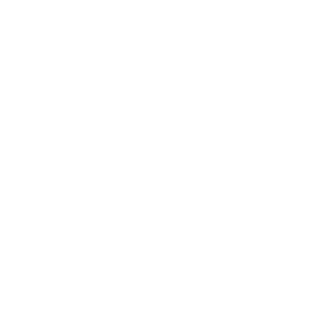
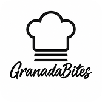

# DIU25
Prácticas Diseño Interfaces de Usuario (Tema: Gastronomía/ocio de degustación ) 

[Guiones de prácticas](GuionesPracticas/)

Grupo: DIU2.AP.  Curso: 2024/25 

Actualizado: 07/03/2025

Proyecto: 

Granada Bites

Descripción: 

Talleres gastronómicos donde el objetivo es divertirse, además de aprender nuevos platos.

Logotipo: 

Miembros:
 * :bust_in_silhouette:  Pablo Fernández Gallardo     :octocat:     [pabloferugr](https://github.com/pabloferugr)
 * :bust_in_silhouette:  Ana Graciani Donaire     :octocat:     [agd03](https://github.com/agd03) (Hasta la práctica 1).

----- 
a

>>> Este documento es el esqueleto del Case Study que explica el proceso de desarrollo de las 5 prácticas de DIU. Aparte de subir cada entrega a PRADO, se debe actualizar y dar formato de informe final a este documento online. Elimine este tipo de texto / comentarios desde la práctica 1 conforme proceda a cada paso

# Proceso de Diseño 

 

## Paso 1. UX User & Desk Research & Analisis 

### 1.a User Reseach Plan
 
-----

[Granada Cooking](https://granadacooking.com/) ofrece talleres de cocina en Granada, dirigidos a turistas y locales interesados en experiencias gastronómicas. No tenemos experiencia previa en este tipo de actividades, por lo que analizaremos la web desde la perspectiva de nuevos usuarios.

Comenzaremos con una visita al establecimiento para comprobar si la ubicación es fácil de encontrar, evaluar el contacto con el negocio y contrastar la información real con la que aparece en la web. Luego, realizaremos un estudio de usabilidad con personas interesadas en la gastronomía que no hayan utilizado antes la web.

El estudio incluirá:

- Pruebas de usuario, en las que los participantes explorarán la web y realizarán tareas como consultar talleres o simular una reserva.
- Entrevistas, para conocer su opinión sobre facilidad de uso y claridad de la información.
- Encuestas, donde valorarán aspectos como navegación, accesibilidad y proceso de reserva.

El objetivo es identificar mejoras para que la web refleje mejor la experiencia real y optimizar la usabilidad.

### 1.b Competitive Analysis
 
-----

[Ver Análisis de Competencia](P1/CompetitorAnalysis.pdf)

**Granada Cooking** se sitúa en un **punto intermedio dentro de su sector**, ofreciendo una propuesta atractiva pero con ciertas limitaciones en comparación con sus competidores. Destaca por su asistencia en tiempo real y la posibilidad de realizar reservas online, lo que la hace accesible y funcional en términos de interacción con los usuarios. Sin embargo, presenta debilidades notables, como la falta de soporte en varios idiomas, lo que puede limitar su alcance a un público más amplio, y la ausencia de un servicio de newsletter que ayude a mantener el interés de sus clientes.

En comparación con **Taller Andaluz de Cocina**, Granada Cooking ofrece una navegación aceptable y asistencia en tiempo real, lo que facilita la interacción con los usuarios. Sin embargo, Taller Andaluz de Cocina proporciona una experiencia más estructurada y en dos idiomas (español e inglés), lo que le da ventaja en accesibilidad para turistas y público extranjero. Además, la navegación en su web es más clara, aunque su diseño sigue siendo algo complejo​CompetitorAnalysis.

Por otro lado, **Food Romance Company** sobresale en facilidad de uso y accesibilidad. Su navegación es la más intuitiva de las tres y su proceso de reserva está mejor optimizado. También ofrece una mayor variedad de cursos y la información está mejor organizada, lo que facilita la toma de decisiones de los usuarios. Granada Cooking, en cambio, tiene problemas con la visualización del calendario, que requiere demasiado desplazamiento y no siempre muestra fechas disponibles de forma clara​CompetitorAnalysis.

Para mejorar su competitividad, Granada Cooking debería trabajar en tres aspectos clave:

- Hacer su web más intuitiva, especialmente el sistema de reservas, que actualmente puede resultar confuso.

- Mejorar la accesibilidad, incluyendo más idiomas para atraer a clientes internacionales.

- Fortalecer la relación con los usuarios, por ejemplo, con una newsletter que informe sobre nuevos cursos y eventos.

En general, Granada Cooking tiene potencial, pero necesita optimizar su usabilidad y comunicación para estar al nivel de sus competidores.

### 1.c Personas
 
-----

**Marta González Carrasco** es una diseñadora gráfica freelance de 34 años, apasionada por el arte, la gastronomía y los viajes culturales. Busca experiencias que combinen creatividad y cocina, disfrutando de descubrir nuevas culturas a través de la comida. Comparte su aprendizaje en redes y se inspira en cada experiencia para su trabajo artístico.

**Juan Ramírez López** es un jubilado de 67 años, apasionado por la historia, la cocina tradicional y la horticultura. Busca pasar más tiempo con su familia compartiendo con ellos sus recetas caseras o realizando algún taller de comida tradicional.

### 1.d User Journey Map
 
----

[Ver User Jouney Map #1 (Marta)](P1/Persona&UserJourneyMap1.pdf)

**Marta** busca un curso de cocina en Granada y encuentra la web de Granada Cooking, que le parece **atractiva**. Pero después se da cuenta de que los **talleres** en la página de inicio están **desactualizados**. Al intentar reservar uno actual, el listado no tiene imágenes, haciéndolo menos atractivo. Cuando intenta reservar el sistema no muestra fechas disponibles ni explica por qué no puede hacerlo. **Frustrada, abandona la web** y busca otra opción.

Este caso muestra cómo una web con buen diseño inicial puede perder usuarios por problemas de usabilidad y contenido desactualizado. La falta de información clara sobre la disponibilidad de talleres y la ausencia de imágenes reducen el atractivo y generan confusión. Esto es común en plataformas que no priorizan la actualización de su contenido ni optimizan su sistema de reservas.

Los principales **problemas** detectados son:

- Información desactualizada, que genera desconfianza.

- Falta de imágenes, lo que hace menos atractiva la experiencia de exploración.

- Sistema de reservas poco claro, sin indicaciones sobre disponibilidad ni errores.

Por lo que proponemos las siguientes **mejoras**:

- Actualizar la información periódicamente.

- Añadir imágenes atractivas en los listados de talleres.

- Optimizar el sistema de reservas, mostrando disponibilidad y mensajes claros.

En general, Granada Cooking ofrece una propuesta interesante, pero necesita mejorar su usabilidad y gestión de contenido para evitar la pérdida de clientes potenciales.

[Ver User Jouney Map #2 (Juan)](P1/Persona&UserJourneyMap2.pdf)

**Juan** busca un taller de cocina en Granada y encuentra la web Granada Cooking, que le parece interesante. Busca **talleres de cocina familiares** pero se da cuenta que estan desactualizados. Ante la falta de información decide ponerse en contancto con el **soporte técnico**. Le dicen que esos talleres ya no están disponibles y acaba **decepcionado**. Finamelmente, abandona la web y busca en otra.

Este caso muestra cómo una web con un buen diseño inicial pierde usuarios por problemas de usabilidad y contenido desactualizado. La falta de ifnformación sobre el contenido de los talleres, genera confunsión y hacen al usuario pedir ayuda, perdiendo así potenciales clientes. Es común ver esto en webs que priorizan el posicionamiento de su web frente a dar una información clara y concisa.

Los principales **problemas** detectados son:

- Información desactualizada.
  
- Falta de contenido en los talleres.
 
- Al contactar con el soporte técnico y recibir la información, no se han planteado alternativas ni otros talleres que podrían interesar al usuario.
  
Por lo que proponemos las siguientes **mejoras**:

- Actualizar la información
  
- Añadir más contenido a los talleres.
  
- Que el soporte técnico ofrezca otras alternativas para evitar una pérdida de cliente.
  
En general, Granada Cooking ofrece una variedad de talleres pero la falta de información y deficiente usabilidad hacen que pierdan clientes como Juan.

### 1.e Usability Review
 
----

[Ver Usability Review](P1/Usability-review.pdf)

Puntuación obtenida: **59/100** (moderado)

Granada Cooking ofrece una web atractiva y bien estructurada, con buena presencia en buscadores y asistencia en tiempo real a través de WhatsApp y formulario de contacto. Pero también presenta fallos que afectan la experiencia de usuario, especialmente en la navegación y el proceso de reserva.

**Puntos fuertes:**

- Diseño visual limpio y con buena legibilidad.

- Contacto directo por WhatsApp, lo que facilita la comunicación.

- Fácil de encontrar en Google.

**Puntos débiles:**

- La página de inicio muestra talleres desactualizados, lo que genera confusión y desconfianza.

- El sistema de reservas es poco intuitivo y no informa sobre la disponibilidad de plazas.

- Falta de filtros y opciones de búsqueda para encontrar talleres fácilmente.

- Algunas secciones tienen tiempos de carga lentos, lo que puede desmotivar a los usuarios.

**Conclusión:**
Aunque la web tiene una buena base, necesita mejorar la usabilidad del sistema de reservas, actualizar su contenido con más frecuencia y optimizar la navegación. Resolver estos problemas evitaría la frustración de los usuarios y ayudaría a aumentar las reservas y la fidelización de clientes.

 

## Paso 2. UX Design  

### 2.a Reframing / IDEACION: Feedback Capture Grid / EMpathy map 
 
----

| Interesante                               | Críticas                                                   |
|-------------------------------------------|------------------------------------------------------------|
| El contenido de los talleres resulta atractivo. | La información de los talleres está desactualizada.         |
| La atención por WhatsApp permite contacto directo. | El sistema de reservas no muestra disponibilidad ni propone alternativas. |

| Preguntas                                              | Nuevas ideas                                              |
|--------------------------------------------------------|-----------------------------------------------------------|
| ¿Qué pasa si un taller está completo?                 | Mostrar automáticamente talleres similares disponibles.    |
| ¿Por qué se muestran talleres no activos en portada?  | Mostrar solo talleres activos con plazas confirmadas.      |
| ¿Por qué no se ofrecen alternativas desde soporte?    | Automatizar sugerencias personalizadas para evitar abandono. |

El principal problema que afecta a usuarios como Juan es que encuentra talleres desactualizados o sin plazas y, al contactar con el soporte, no recibe sugerencias de alternativas. Mi **hipótesis** es que si la web solo muestra talleres actualizados y ofrece sugerencias automáticas cuando no hay disponibilidad, los usuarios no abandonarán la plataforma, aumentando así su satisfacción y las reservas.

EMPATTHY MAP

  
  **Juan**, nuestro usuario principal, es una persona mayor interesada en talleres familiares. Se siente confundido cuando ve talleres desactualizados en la portada y decepcionado al no recibir opciones alternativas desde el soporte. Necesita una experiencia fluida, con información clara y actualizada que le permita tomar decisiones sin depender de ayuda externa.

### 2.b ScopeCanvas

----

Lo que hace a mi proyecto diferente es que el sistema de reservas muestra **únicamente talleres activos y con plazas disponibles**. Además, si un taller está completo, se ofrecen automáticamente **sugerencias de otros talleres similares**. Esta mejora evita la pérdida de usuarios como Juan y facilita la navegación de nuevos visitantes.

### 2.b User Flow (task) analysis 
 
-----

* User
  
  1. El usuario accede a la web.
  2. Navega por los talleres disponibles (con filtros).
  3. Si un taller está lleno, el sistema le sugiere otros similares.
  4. Puede registrarse para guardar sus reservas o recibir más recomendaciones.

USER FLOW LOGUEADO

**Usuarios con cuenta**: han reservado previamente o planean hacerlo varias veces. Esperan un sistema más personalizado, con sugerencias y gestión de reservas.

USER FLOW NO LOGUEADO

**Usuarios sin cuenta**: acceden de forma ocasional. Solo buscan un taller disponible y esperan poder reservar con facilidad.

TASK ANALISIS

Esta tabla recoge las tareas clave que un usuario como Juan debe poder realizar dentro del rediseño de Granada Cooking. Se ha diferenciado entre usuarios sin cuenta (como Juan en su primera visita) y usuarios con cuenta, para reflejar cómo mejora la experiencia si el usuario decide registrarse.

Las tareas más importantes —como ver talleres disponibles, comprobar la disponibilidad, recibir sugerencias automáticas y completar una reserva— están disponibles para todos los usuarios.
Sin embargo, aquellos con cuenta se benefician de un proceso más ágil, sin necesidad de introducir datos personales en cada reserva y con acceso a su historial, lo que les facilita repetir experiencias o guardar sus favoritas.

| Tarea                                                       | Sin cuenta | Con cuenta | Total |
|-------------------------------------------------------------|------------|------------|-------|
| Ver talleres disponibles (filtrados y actualizados)         |     3      |     3      |   6   |
| Ver información y disponibilidad del taller                 |     3      |     3      |   6   |
| Recibir sugerencias si el taller está lleno                 |     3      |     3      |   6   |
| Iniciar el proceso de reserva                               |     3      |     3      |   6   |
| Introducir datos personales                                 |     3      |     0      |   3   |
| Escoger forma de pago                                       |     3      |     3      |   6   |
| Confirmar la reserva                                        |     3      |     3      |   6   |
| Crear cuenta (opcional en la reserva)                       |     2      |     0      |   2   |
| Consultar calendario con fechas disponibles                 |     2      |     2      |   4   |
| Cambiar idioma de la web                                    |     2      |     2      |   4   |
| Usar filtros para buscar talleres específicos               |     2      |     2      |   4   |
| Ver taller sugerido y reservarlo                            |     2      |     2      |   4   |
| Ver su historial de reservas                                |     0      |     2      |   2   |
| Acceder a su cuenta                                         |     0      |     2      |   2   |

### 2.c IA: Sitemap + Labelling 
 
----

SITE MAP

La estructura del sitio se ha rediseñado para que los talleres disponibles estén claramente destacados desde la portada. Se prioriza el acceso a filtros por fecha, tipo de cocina o nivel, junto con acceso directo a contacto.

LABELLING

| Término                 | Significado                                                                 |
|-------------------------|------------------------------------------------------------------------------|
| **Inicio**              | Página principal con talleres destacados y acceso a filtros.                |
| **Talleres disponibles**| Lista filtrada de talleres activos y con plazas disponibles.                |
| **Calendario**          | Vista mensual con fechas de los talleres; solo muestra fechas con plazas.   |
| **Ver disponibilidad**  | Información clara sobre si hay plazas o está completo.                     |
| **Sugerencias**         | Talleres alternativos mostrados automáticamente si el seleccionado está completo. |
| **Buscar taller**       | Barra de búsqueda con filtros por temática, nivel, fecha o idioma.          |
| **Filtrar por...**      | Opciones para acotar resultados por tipo de cocina, nivel, fecha, etc.      |
| **Reservar ahora**      | Botón para iniciar el proceso de reserva si hay plazas.                     |
| **No hay plazas**       | Mensaje visible que muestra que el taller está completo.                    |
| **Ver más talleres**    | Llama a la acción para seguir explorando opciones similares.                |
| **Iniciar sesión / Registrarse** | Acceso para usuarios con cuenta o registro de nuevos.               |
| **Cuenta**              | Sección donde el usuario ve sus datos, reservas, etc.                       |
| **Pagar**               | Página donde se escoge y confirma el método de pago.                        |
| **Formas de pago**      | Desplegable para elegir entre tarjeta, PayPal, Bizum, etc.                  |
| **Idioma**              | Selector visible para cambiar entre español e inglés.                       |
| **RRSS**                | Vista previa y enlaces a redes sociales de Granada Cooking.                 |

### 2.d Wireframes
 
-----

Utilizo el plugin breakpoints de Figma para hacer el cambio de tamaño de la pantalla a dispositivos móviles. Básicamente consiste en unir en columnas los elementos.

 

## Paso 3. Mi UX-Case Study (diseño)

### 3.a Moodboard

-----

El moodboard define la identidad visual de nuestro proyecto, orientado a adultos mayores que desean disfrutar la cocina como experiencia social, relajada y compartida.

Se ha trabajado en Figma para organizar los elementos clave del diseño:

Paleta de colores: blanco, negro, rojo (#DD0707) y gris claro (#C4C4C4), que aportan contraste, claridad y calidez.

Tipografías:

Rocketwildness: aporta personalidad y estilo artesanal en títulos.

Roboto Flex: facilita la lectura en bloques de texto largos.

Avenir LT Pro: aplicada específicamente en calendarios por su legibilidad numérica.

También se han añadido imágenes de platos caseros, escenas intergeneracionales en cocina y detalles de ingredientes, que evocan tradición, cuidado y comunidad.

Herramientas utilizadas:

Figma: para construir y organizar visualmente la guía.

Coolors.co: para generar y validar combinaciones cromáticas.

Designs.ai/fonts y FontPair: para la elección tipográfica.

### 3.b Landing Page
 
----

Contenido principal:

Cabecera con logotipo y menú claro: Talleres, Calendario, Información y Ajustes.

Mensaje de bienvenida emocional y directo: “Cocinamos juntos, como en familia”.

Breve descripción del propósito: se destacan los talleres como espacios para aprender, disfrutar y conocer gente nueva.

Secciones visuales para los tres tipos de curso: Entrantes, Principal y Postres.

Bloque de información de contacto: ubicación (Plaza de Gracia 11, Granada), botones para compartir y redes sociales.

### 3.c Guidelines
 
----

Se han definido las siguientes guidelines y patrones de interfaz:

Alto contraste (#DD0707 fondo y blanco texto), accesibles para personas con visión reducida.

Tipografía Roboto Flex en todos los textos largos, garantizando legibilidad.

Jerarquía visual clara: títulos grandes, descripciones cortas, acciones destacadas en rojo.

Calendario con Avenir LT Pro, para asegurar alineación limpia y buena lectura de fechas.

Estructura responsive en columnas simples para que sea usable en móviles y tablets.

Estas decisiones están documentadas en base a los principios de accesibilidad (WCAG) y buenas prácticas UI del sistema Material Design.

### 3.d Mockup
 
----

El mockup fue realizado en Figma con un diseño funcional y realista del layout en acción.
Dado que el proyecto excede el número de prototipos activos en la cuenta, se ha compartido el enlace por correo.

Simula el recorrido del usuario:

Desde la landing page hasta la selección de taller, información del taller, la visualización del calendario y compra completada.

Se ha priorizado la claridad, el contraste y el uso de patrones reconocibles por el público objetivo.

Este mockup permite probar la experiencia real con stakeholders, recibir feedback y validar decisiones visuales y funcionales antes del paso a desarrollo.

[Layout - Simulacion](https://www.figma.com/design/gyl0wKx41oVChxRt5Fv21A/Layout?node-id=2178-65444&t=8XBOcgWZlY5Mqen4-1)

 

## Paso 4. Pruebas de Evaluación 

### 4.a Reclutamiento de usuarios 

-----

El caso A corresponde al rediseño web de Granada Bites, una propuesta de talleres gastronómicos presenciales orientados a un público adulto en la ciudad de Granada. El objetivo del proyecto es facilitar la participación en estas actividades, permitiendo consultar los talleres disponibles, visualizar el calendario actualizado y realizar reservas de forma sencilla desde una página web accesible, emocional y clara.

La propuesta se inspira en valores como la convivencia intergeneracional, el placer por la cocina tradicional y el aprendizaje compartido. Estos conceptos se reflejan en el diseño visual mediante una paleta de colores cálidos y contrastados (blanco, negro, rojo y gris), tipografías legibles y una estructura que favorece la navegación en dispositivos móviles. Entre las secciones clave de la web se encuentran: página de inicio con talleres destacados, calendario interactivo, ficha informativa de cada actividad, formulario de reserva, y un bloque de contacto accesible para cualquier usuario.

| Usuario         | Sexo / Edad      | Ocupación                  | Experiencia TIC | Personalidad | Plataforma | Caso | Posibles situaciones conflictivas                                                                                                                                                   |
| --------------- | ---------------- | -------------------------- | --------------- | ------------ | ---------- | ---- | ----------------------------------------------------------------------------------------------------------------------------------------------------------------------------------- |
| **U1 - Clara**  | Mujer / 23 años  | Estudiante | Alta            | Introvertida | Móvil      | A    | Puede sentirse perdida si la jerarquía visual no está clara o si hay exceso de información. Le interesa el diseño y el contenido cultural, pero necesita una navegación muy guiada. |
| **U2 - Andrés** | Hombre / 22 años | Estudiante     | Alta            | Racional     | Móvil      | A    | Requiere una estructura lógica. Si la navegación no sigue un orden claro o las funciones no están bien etiquetadas, puede sentirse confundido y abandonar la tarea.  

### 4.b Diseño de las pruebas 
 
-----

Se ha planificado un conjunto de pruebas para evaluar la **usabilidad y eficacia de los prototipos correspondientes a los casos A (Granada Bites) y B (La Taberna de Kafka)**, utilizando técnicas habituales en investigación UX.
Las pruebas se han desarrollado de forma remota, a través de la plataforma **Maze** para los tests interactivos, y **Gaze Recorder** para el análisis de eye tracking en el caso B.

Aunque no se aplicó formalmente el checklist de la P1, se tuvieron en cuenta principios clave como la **visibilidad del estado del sistema, control del usuario, consistencia y prevención de errores** durante la recogida de comentarios y observación de las interacciones.

---

#### 1. A/B Testing (Maze)

Se diseñaron dos tests en Maze, uno para cada prototipo (Granada Bites y La Taberna de Kafka), asignando **un usuario a cada uno**. Ambos tests incluían **tareas equivalentes**, como consultar el calendario, acceder a contenidos específicos y explorar libremente la interfaz.

Las métricas recogidas fueron:

* Nivel de confianza en la navegación (Confidence Level)
* Éxito en la realización de tareas
* Respuestas subjetivas en escala del 1 al 6
* Comentarios y observaciones post-test

Esto permitió **comparar la claridad de los flujos de interacción, el diseño visual y la facilidad de uso** de cada prototipo.

---

#### 2. Test SUS (System Usability Scale)

Tras completar el test de tareas, se aplicó a cada usuario el **cuestionario estándar SUS**, compuesto por 10 ítems valorados en una escala de 1 a 5. Las preguntas se adaptaron al lenguaje del contexto web, y las respuestas se utilizaron para calcular la **puntuación SUS total por prototipo**.

Este cuestionario permitió una **evaluación objetiva de la percepción de usabilidad** y facilitó la comparación cuantitativa entre los dos diseños.

---

#### 3. Eye Tracking (solo en caso B – La Taberna de Kafka)

Para complementar el análisis de usabilidad, se utilizó **eye tracking únicamente en el caso B (La Taberna de Kafka)**, mediante la herramienta **Gaze Recorder (versión gratuita)**.
El usuario asignado a este caso fue expuesto durante **20 segundos** a la pantalla de inicio del prototipo, con la siguiente instrucción:

> “Observa la pantalla como si estuvieras usando una app nueva.”

A partir de la grabación se generó un **mapa de calor**, lo que permitió identificar qué elementos captaban más atención visual (zonas calientes) y cuáles pasaban desapercibidos.
Esto ayudó a **validar la efectividad visual del diseño inicial** y a detectar posibles ajustes en cuanto a jerarquía y colocación de elementos clave.

### 4.c Cuestionario SUS
 
----

Se realizó una prueba comparativa A/B entre dos prototipos web con el objetivo de evaluar la experiencia de usuario en tareas clave, así como la percepción subjetiva sobre la claridad, estética y funcionalidad del diseño. Los prototipos evaluados fueron:

* **Caso A**: Granada Bites
* **Caso B**: La Taberna de Kafka

---

#### **Test A – Granada Bites**

**Tareas:**

* Reservar un taller de cocina para el fin de semana.
* Consultar el calendario con fechas disponibles.
* Explorar libremente el sitio web.

**Feedback recogido:**

* **Opinión general media:** 5.25/6
* Valoración positiva del diseño enfocado a adultos mayores, con buen uso de jerarquía visual.
* Facilidad para usar el sistema de reservas y encontrar el calendario.
* Estética cálida, emocional y accesible.

**Enlace al test:** [Granada Bites – Maze](https://t.maze.co/tu-enlace-aqui)
**Resultados:** Recogidos desde Maze.

---

#### **Test B – La Taberna de Kafka**

**Tareas:**

* Acceder al calendario de eventos del local.
* Consultar la información de una cata de vinos.
* Explorar libremente la aplicación.

**Feedback recogido:**

* **Opinión general media:** 5.5/6
* Los usuarios accedieron con facilidad al calendario y valoraron muy positivamente la presentación de los eventos.
* Diseño percibido como funcional, bien estructurado y visualmente atractivo.
* La experiencia general fue calificada como muy satisfactoria.

**Resultados:** Para este caso he tenido que hacerlo de manera física ya que Maze daba problemas al importar un proyecto de figma externo a tu cuenta.

---

### Resultados por usuario

| **PREGUNTAS**                                                     | **U1 – Granada Bites (A)** | **U2 – La Taberna de Kafka (B)** |
| ----------------------------------------------------------------- | -------------------------- | -------------------------------- |
| **1. ¿Cómo calificarías tu experiencia general usando esta app?** | 5                          | 6                                |
| **2. ¿Encontraste lo que buscabas fácilmente?**                   | 5                          | 5                                |
| **3. ¿Recomendarías esta app a otras personas?**                  | 5                          | 5                                |
| **4. ¿La aplicación te resultó atractiva visualmente?**           | 6                          | 6                                |

> *(Escala de 1 a 6)*

---

### Conclusión del A/B Testing

Ambos prototipos obtuvieron excelentes resultados, pero **La Taberna de Kafka (caso B)** fue **ligeramente mejor valorado**, con una media general superior (**5.5 frente a 5.25**). Su diseño fue considerado más equilibrado visualmente y con una navegación fluida, sin perder la estética.

**Granada Bites (caso A)** sigue ofreciendo una experiencia clara y accesible, especialmente adaptada al público adulto mayor, con un enfoque más emocional y directo.

**En resumen**, ambos casos presentan un alto nivel de usabilidad, pero **el caso B destaca levemente** por su estructura generalista y diseño funcional.

### 4.d A/B Testing
 
-----
Se utilizó el cuestionario **SUS (System Usability Scale)** para recoger la percepción de usabilidad de cada usuario tras realizar las tareas asignadas a su prototipo. El cuestionario consta de 10 ítems con escala de 1 a 5, alternando afirmaciones positivas y negativas. Las puntuaciones se calcularon siguiendo la fórmula oficial de SUS.

| PREGUNTAS                                                                | U1 – Granada Bites (A) | U2 – La Taberna de Kafka (B) |
| ------------------------------------------------------------------------ | ---------------------- | ---------------------------- |
| 1. Creo que me gustará visitar con frecuencia este website               | 4                      | 5                            |
| 2. Encontré el website innecesariamente complejo                         | 2                      | 1                            |
| 3. Pensé que era fácil utilizar este website                             | 4                      | 5                            |
| 4. Creo que necesitaría del apoyo de un experto para recorrer el website | 2                      | 1                            |
| 5. Encontré las funciones del website bastante bien integradas           | 4                      | 5                            |
| 6. Pensé que había demasiada inconsistencia en el website                | 2                      | 1                            |
| 7. Imagino que la mayoría de las personas aprenderían rápidamente        | 4                      | 5                            |
| 8. Encontré el website muy grande al recorrerlo                          | 2                      | 1                            |
| 9. Me sentí muy confiado en el manejo del website                        | 4                      | 5                            |
| 10. Necesito aprender muchas cosas antes de manejar el website           | 2                      | 1                            |

---

### Resultados SUS

| Usuario | Caso                    | Puntuación SUS |
| ------- | ----------------------- | -------------- |
| U1      | Granada Bites (A)       | **85.0**       |
| U2      | La Taberna de Kafka (B) | **90.0**       |

---

### Análisis de resultados

Ambos prototipos alcanzaron puntuaciones altas en el cuestionario SUS, situándose por encima del umbral de excelencia. La **Taberna de Kafka** obtiene una puntuación levemente superior, lo que indica una percepción más clara de usabilidad, fluidez y confianza.

* **Granada Bites (A)**: 85.0 → Experiencia excelente
* **Kafka (B)**: 90.0 → Experiencia excelente con margen aún más alto de eficacia

---

### 🗣Valoración personal

En este caso, **estoy de acuerdo con el resultado obtenido**. Aunque **Granada Bites** ofrece una experiencia accesible, clara y emocionalmente conectada con su público objetivo, el prototipo de **La Taberna de Kafka** destaca ligeramente por su estructura visual más sólida, su jerarquía más marcada y una navegación más fluida.

Kafka demuestra una experiencia mejor balanceada, donde tanto el contenido como las funciones están organizadas con mayor precisión, lo que repercute en una interacción más intuitiva. A pesar de que Granada Bites cumple notablemente con los principios de usabilidad, **Kafka presenta un diseño más pulido y eficaz a largo plazo**.

---

### 4.e Aplicación del método Eye Tracking 

----

>>> Indica cómo se diseña el experimento y se reclutan los usuarios. Explica la herramienta / uso de gazerecorder.com u otra similar. Aplíquese únicamente al caso B.

  
>>> Cambiar esta img por una de vuestro experimento. El recurso deberá estar subido a la carpeta P4/  

>>> gazerecorder en versión de pruebas puede estar limitada a 3 usuarios para generar mapa de calor (crédito > 0 para que funcione) 

### 4.f Usability Report de B
 
-----

### 🧪 Evaluación de Usabilidad del Proyecto

**La Taberna de Kafka**
Fecha: 01/06/2025
[Enlace al repositorio GitHub del proyecto: https://github.com/pablofernandez/DIU-Kafka](https://github.com/pablofernandez/DIU-Kafka)

**Realizado por:**
Este informe ha sido elaborado por el equipo del caso A (Granada Bites), como parte del trabajo comparativo de la Práctica 4 en la asignatura DIU. La evaluación de **La Taberna de Kafka** se ha realizado con la colaboración del equipo correspondiente, siguiendo las mismas pautas metodológicas que nuestro prototipo, con el objetivo de comparar ambas experiencias desde una perspectiva objetiva de usabilidad.

---

### 1. Descripción del Website

**La Taberna de Kafka es un establecimiento granadino enfocado en experiencias gastronómicas con vinos, eventos y ambiente cultural. Su nuevo prototipo web busca ofrecer una plataforma actualizada que permita realizar reservas, consultar eventos, acceder a un sistema exclusivo de invitación y recibir información del local en tiempo real, mejorando así el canal de comunicación con sus clientes y modernizando su presencia digital. El diseño se caracteriza por una estética sobria y elegante inspirada en el vino y la atmósfera del local.

---

### 2. Resumen Ejecutivo

La evaluación de este prototipo se ha llevado a cabo aplicando una combinación de métodos cuantitativos y cualitativos, incluyendo:

* Test A/B con tareas equivalentes al caso A
* Cuestionario SUS (System Usability Scale)
* Eye tracking (exploración libre sobre la pantalla inicial)

**Principales resultados positivos:**

* Alta percepción de claridad y navegación fluida
* Facilidad para encontrar eventos y calendario
* Estética limpia y profesional

**Aspectos mejorables detectados:**

* Algunos elementos clave (botones o accesos rápidos) podrían destacarse más visualmente
* Faltaría una pantalla de inicio más general como punto de partida para toda la navegación

---

### 3. Metodología

**Técnicas utilizadas:**

* **A/B Testing** (tareas de exploración y localización de contenidos)
* **SUS** (encuesta post-test de percepción de usabilidad)
* **Eye Tracking** con Gaze Recorder, para evaluar la atención visual del usuario en el layout inicial

**Usuarios participantes:**

| Usuario | Sexo / Edad | Ocupación  | Exp. TIC | Personalidad | Plataforma | Caso |
| ------- | ----------- | ---------- | -------- | ------------ | ---------- | ---- |
| U2      | Hombre / 22 | Estudiante | Alta     | Racional     | Móvil      | B    |
| U4      | Mujer / 24 | Estudiante | Media    | Introvertida    | Móvil      | B    |

---

### 4. Resultados

* **SUS Score promedio:** **90,0** → **Valoración: Excelente**
* **A/B testing:** tareas completadas sin incidencias. La navegación fue clara, especialmente en el acceso al calendario y fichas de eventos.
* **Eye Tracking:** atención visual centrada en el área de eventos y calendario. Elementos secundarios (como navegación lateral) recibieron menos atención, lo que sugiere oportunidades para mejorar la jerarquía visual.

---

### 5. Conclusiones

**Fortalezas:**

* Navegación clara y consistente
* Diseño visual limpio, agradable y adaptado al contexto gastronómico
* Muy buena percepción general por parte de los usuarios

**Puntos de mejora:**

* Aumentar visibilidad de algunos elementos secundarios relevantes
* Añadir una **pantalla inicial de tipo “Home”** que sirva de entrada general al sistema
* Potenciar jerarquía visual en algunos accesos clave, como filtros o llamadas a la acción

---

### 6. Valoración de la Prueba de Usabilidad (Autoevaluación)

El uso combinado de tareas, encuesta SUS y mapas de calor ha sido fundamental para obtener una evaluación completa y realista del comportamiento del usuario. La información extraída del eye tracking permitió identificar no solo lo que se usa, sino lo que **se percibe o se ignora**, lo que es crucial en etapas tempranas de diseño.

En resumen, **La Taberna de Kafka** presenta un prototipo robusto, usable y visualmente equilibrado, con una percepción muy positiva por parte de los usuarios evaluados. Los pequeños ajustes recomendados permitirían elevar aún más su efectividad como producto digital real.

 

## Paso 5. Exportación y Documentación 

### 5.a Exportación a HTML/React
 
----

>>> Breve descripción de esta tarea. Las evidencias de este paso quedan subidas a P5/

### 5.b Documentación con Storybook

----

>>> Breve descripción de esta tarea. Las evidencias de este paso quedan subidas a P5/

 

## Conclusiones finales & Valoración de las prácticas

>>> Opinión FINAL del proceso de desarrollo de diseño siguiendo metodología UX y valoración (positiva /negativa) de los resultados obtenidos. ¿Qué se puede mejorar? Recuerda que este tipo de texto se debe eliminar del template que se os proporciona 

