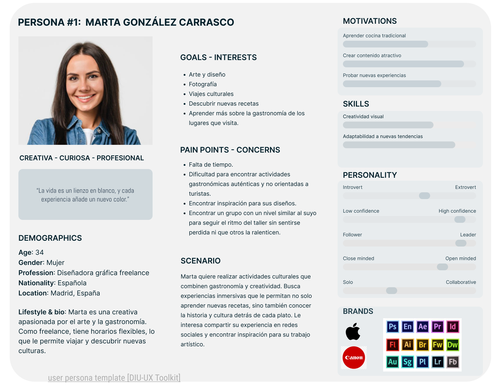
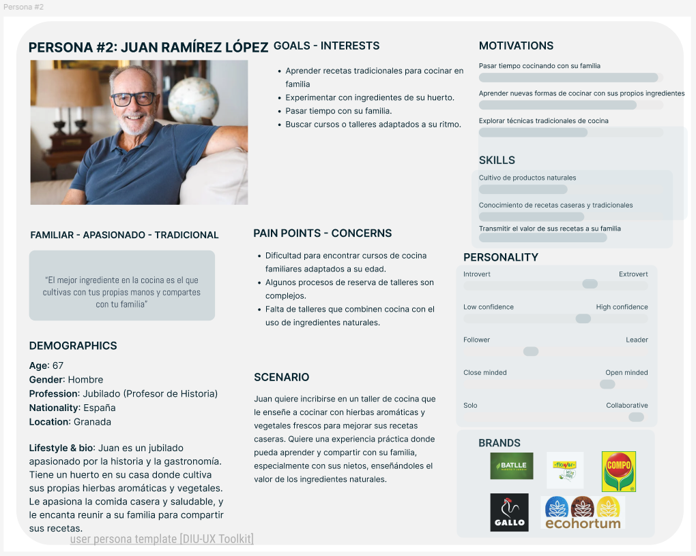
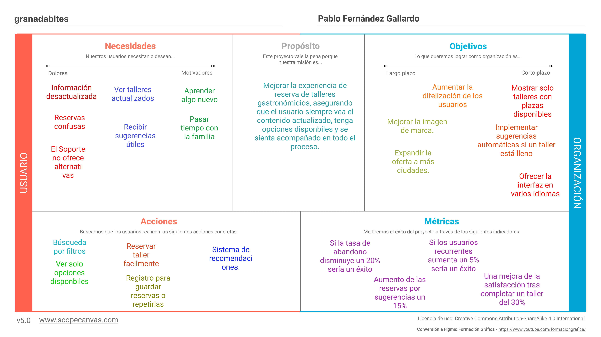
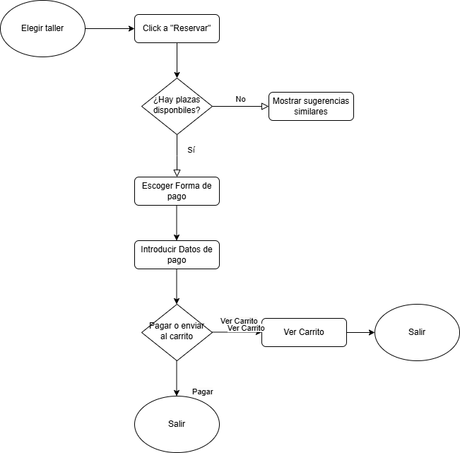
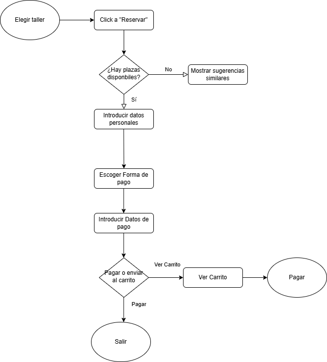

# DIU25
Prácticas Diseño Interfaces de Usuario (Tema: Gastronomía/ocio de degustación ) 

[Guiones de prácticas](GuionesPracticas/)

Grupo: DIU2.AP.  Curso: 2024/25 

Actualizado: 07/03/2025

Proyecto: 

Granada Bites

Descripción: 

Talleres gastronómicos donde el objetivo es divertirse, además de aprender nuevos platos.

Logotipo: 

>>> Si diseña un logotipo para su producto en la práctica 3 pongalo aqui, a un tamaño adecuado. Si diseña un slogan añadalo aquí

Miembros:
 * :bust_in_silhouette:  Pablo Fernández Gallardo     :octocat:     [pabloferugr](https://github.com/pabloferugr)
 * :bust_in_silhouette:  Ana Graciani Donaire     :octocat:     [agd03](https://github.com/agd03) (Hasta la práctica 1).

----- 

>>> Este documento es el esqueleto del Case Study que explica el proceso de desarrollo de las 5 prácticas de DIU. Aparte de subir cada entrega a PRADO, se debe actualizar y dar formato de informe final a este documento online. Elimine este tipo de texto / comentarios desde la práctica 1 conforme proceda a cada paso

# Proceso de Diseño 

 

## Paso 1. UX User & Desk Research & Analisis 

### 1.a User Reseach Plan
 
-----

[Granada Cooking](https://granadacooking.com/) ofrece talleres de cocina en Granada, dirigidos a turistas y locales interesados en experiencias gastronómicas. No tenemos experiencia previa en este tipo de actividades, por lo que analizaremos la web desde la perspectiva de nuevos usuarios.

Comenzaremos con una visita al establecimiento para comprobar si la ubicación es fácil de encontrar, evaluar el contacto con el negocio y contrastar la información real con la que aparece en la web. Luego, realizaremos un estudio de usabilidad con personas interesadas en la gastronomía que no hayan utilizado antes la web.

El estudio incluirá:

- Pruebas de usuario, en las que los participantes explorarán la web y realizarán tareas como consultar talleres o simular una reserva.
- Entrevistas, para conocer su opinión sobre facilidad de uso y claridad de la información.
- Encuestas, donde valorarán aspectos como navegación, accesibilidad y proceso de reserva.

El objetivo es identificar mejoras para que la web refleje mejor la experiencia real y optimizar la usabilidad.

### 1.b Competitive Analysis
 
-----

[Ver Análisis de Competencia](P1/CompetitorAnalysis.pdf)

**Granada Cooking** se sitúa en un **punto intermedio dentro de su sector**, ofreciendo una propuesta atractiva pero con ciertas limitaciones en comparación con sus competidores. Destaca por su asistencia en tiempo real y la posibilidad de realizar reservas online, lo que la hace accesible y funcional en términos de interacción con los usuarios. Sin embargo, presenta debilidades notables, como la falta de soporte en varios idiomas, lo que puede limitar su alcance a un público más amplio, y la ausencia de un servicio de newsletter que ayude a mantener el interés de sus clientes.

En comparación con **Taller Andaluz de Cocina**, Granada Cooking ofrece una navegación aceptable y asistencia en tiempo real, lo que facilita la interacción con los usuarios. Sin embargo, Taller Andaluz de Cocina proporciona una experiencia más estructurada y en dos idiomas (español e inglés), lo que le da ventaja en accesibilidad para turistas y público extranjero. Además, la navegación en su web es más clara, aunque su diseño sigue siendo algo complejo​CompetitorAnalysis.

Por otro lado, **Food Romance Company** sobresale en facilidad de uso y accesibilidad. Su navegación es la más intuitiva de las tres y su proceso de reserva está mejor optimizado. También ofrece una mayor variedad de cursos y la información está mejor organizada, lo que facilita la toma de decisiones de los usuarios. Granada Cooking, en cambio, tiene problemas con la visualización del calendario, que requiere demasiado desplazamiento y no siempre muestra fechas disponibles de forma clara​CompetitorAnalysis.

Para mejorar su competitividad, Granada Cooking debería trabajar en tres aspectos clave:

- Hacer su web más intuitiva, especialmente el sistema de reservas, que actualmente puede resultar confuso.

- Mejorar la accesibilidad, incluyendo más idiomas para atraer a clientes internacionales.

- Fortalecer la relación con los usuarios, por ejemplo, con una newsletter que informe sobre nuevos cursos y eventos.

En general, Granada Cooking tiene potencial, pero necesita optimizar su usabilidad y comunicación para estar al nivel de sus competidores.

### 1.c Personas
 
-----

**Marta González Carrasco** es una diseñadora gráfica freelance de 34 años, apasionada por el arte, la gastronomía y los viajes culturales. Busca experiencias que combinen creatividad y cocina, disfrutando de descubrir nuevas culturas a través de la comida. Comparte su aprendizaje en redes y se inspira en cada experiencia para su trabajo artístico.

**Juan Ramírez López** es un jubilado de 67 años, apasionado por la historia, la cocina tradicional y la horticultura. Busca pasar más tiempo con su familia compartiendo con ellos sus recetas caseras o realizando algún taller de comida tradicional.

### 1.d User Journey Map
 
----

[Ver User Jouney Map #1 (Marta)](P1/Persona&UserJourneyMap1.pdf)

**Marta** busca un curso de cocina en Granada y encuentra la web de Granada Cooking, que le parece **atractiva**. Pero después se da cuenta de que los **talleres** en la página de inicio están **desactualizados**. Al intentar reservar uno actual, el listado no tiene imágenes, haciéndolo menos atractivo. Cuando intenta reservar el sistema no muestra fechas disponibles ni explica por qué no puede hacerlo. **Frustrada, abandona la web** y busca otra opción.

Este caso muestra cómo una web con buen diseño inicial puede perder usuarios por problemas de usabilidad y contenido desactualizado. La falta de información clara sobre la disponibilidad de talleres y la ausencia de imágenes reducen el atractivo y generan confusión. Esto es común en plataformas que no priorizan la actualización de su contenido ni optimizan su sistema de reservas.

Los principales **problemas** detectados son:

- Información desactualizada, que genera desconfianza.

- Falta de imágenes, lo que hace menos atractiva la experiencia de exploración.

- Sistema de reservas poco claro, sin indicaciones sobre disponibilidad ni errores.

Por lo que proponemos las siguientes **mejoras**:

- Actualizar la información periódicamente.

- Añadir imágenes atractivas en los listados de talleres.

- Optimizar el sistema de reservas, mostrando disponibilidad y mensajes claros.

En general, Granada Cooking ofrece una propuesta interesante, pero necesita mejorar su usabilidad y gestión de contenido para evitar la pérdida de clientes potenciales.

[Ver User Jouney Map #2 (Juan)](P1/Persona&UserJourneyMap2.pdf)

**Juan** busca un taller de cocina en Granada y encuentra la web Granada Cooking, que le parece interesante. Busca **talleres de cocina familiares** pero se da cuenta que estan desactualizados. Ante la falta de información decide ponerse en contancto con el **soporte técnico**. Le dicen que esos talleres ya no están disponibles y acaba **decepcionado**. Finamelmente, abandona la web y busca en otra.

Este caso muestra cómo una web con un buen diseño inicial pierde usuarios por problemas de usabilidad y contenido desactualizado. La falta de ifnformación sobre el contenido de los talleres, genera confunsión y hacen al usuario pedir ayuda, perdiendo así potenciales clientes. Es común ver esto en webs que priorizan el posicionamiento de su web frente a dar una información clara y concisa.

Los principales **problemas** detectados son:

- Información desactualizada.
  
- Falta de contenido en los talleres.
 
- Al contactar con el soporte técnico y recibir la información, no se han planteado alternativas ni otros talleres que podrían interesar al usuario.
  
Por lo que proponemos las siguientes **mejoras**:

- Actualizar la información
  
- Añadir más contenido a los talleres.
  
- Que el soporte técnico ofrezca otras alternativas para evitar una pérdida de cliente.
  
En general, Granada Cooking ofrece una variedad de talleres pero la falta de información y deficiente usabilidad hacen que pierdan clientes como Juan.

### 1.e Usability Review
 
----

[Ver Usability Review](P1/Usability-review.pdf)

Puntuación obtenida: **59/100** (moderado)

Granada Cooking ofrece una web atractiva y bien estructurada, con buena presencia en buscadores y asistencia en tiempo real a través de WhatsApp y formulario de contacto. Pero también presenta fallos que afectan la experiencia de usuario, especialmente en la navegación y el proceso de reserva.

**Puntos fuertes:**

- Diseño visual limpio y con buena legibilidad.

- Contacto directo por WhatsApp, lo que facilita la comunicación.

- Fácil de encontrar en Google.

**Puntos débiles:**

- La página de inicio muestra talleres desactualizados, lo que genera confusión y desconfianza.

- El sistema de reservas es poco intuitivo y no informa sobre la disponibilidad de plazas.

- Falta de filtros y opciones de búsqueda para encontrar talleres fácilmente.

- Algunas secciones tienen tiempos de carga lentos, lo que puede desmotivar a los usuarios.

**Conclusión:**
Aunque la web tiene una buena base, necesita mejorar la usabilidad del sistema de reservas, actualizar su contenido con más frecuencia y optimizar la navegación. Resolver estos problemas evitaría la frustración de los usuarios y ayudaría a aumentar las reservas y la fidelización de clientes.

 

## Paso 2. UX Design  

### 2.a Reframing / IDEACION: Feedback Capture Grid / EMpathy map 
 
----

| Interesante                               | Críticas                                                   |
|-------------------------------------------|------------------------------------------------------------|
| El contenido de los talleres resulta atractivo. | La información de los talleres está desactualizada.         |
| La atención por WhatsApp permite contacto directo. | El sistema de reservas no muestra disponibilidad ni propone alternativas. |

| Preguntas                                              | Nuevas ideas                                              |
|--------------------------------------------------------|-----------------------------------------------------------|
| ¿Qué pasa si un taller está completo?                 | Mostrar automáticamente talleres similares disponibles.    |
| ¿Por qué se muestran talleres no activos en portada?  | Mostrar solo talleres activos con plazas confirmadas.      |
| ¿Por qué no se ofrecen alternativas desde soporte?    | Automatizar sugerencias personalizadas para evitar abandono. |

El principal problema que afecta a usuarios como Juan es que encuentra talleres desactualizados o sin plazas y, al contactar con el soporte, no recibe sugerencias de alternativas. Mi **hipótesis** es que si la web solo muestra talleres actualizados y ofrece sugerencias automáticas cuando no hay disponibilidad, los usuarios no abandonarán la plataforma, aumentando así su satisfacción y las reservas.

EMPATTHY MAP

  
  **Juan**, nuestro usuario principal, es una persona mayor interesada en talleres familiares. Se siente confundido cuando ve talleres desactualizados en la portada y decepcionado al no recibir opciones alternativas desde el soporte. Necesita una experiencia fluida, con información clara y actualizada que le permita tomar decisiones sin depender de ayuda externa.

### 2.b ScopeCanvas

----

Lo que hace a mi proyecto diferente es que el sistema de reservas muestra **únicamente talleres activos y con plazas disponibles**. Además, si un taller está completo, se ofrecen automáticamente **sugerencias de otros talleres similares**. Esta mejora evita la pérdida de usuarios como Juan y facilita la navegación de nuevos visitantes.

### 2.b User Flow (task) analysis 
 
-----

* User
  
  1. El usuario accede a la web.
  2. Navega por los talleres disponibles (con filtros).
  3. Si un taller está lleno, el sistema le sugiere otros similares.
  4. Puede registrarse para guardar sus reservas o recibir más recomendaciones.

USER FLOW LOGUEADO

**Usuarios con cuenta**: han reservado previamente o planean hacerlo varias veces. Esperan un sistema más personalizado, con sugerencias y gestión de reservas.

USER FLOW NO LOGUEADO

**Usuarios sin cuenta**: acceden de forma ocasional. Solo buscan un taller disponible y esperan poder reservar con facilidad.

TASK ANALISIS

Esta tabla recoge las tareas clave que un usuario como Juan debe poder realizar dentro del rediseño de Granada Cooking. Se ha diferenciado entre usuarios sin cuenta (como Juan en su primera visita) y usuarios con cuenta, para reflejar cómo mejora la experiencia si el usuario decide registrarse.

Las tareas más importantes —como ver talleres disponibles, comprobar la disponibilidad, recibir sugerencias automáticas y completar una reserva— están disponibles para todos los usuarios.
Sin embargo, aquellos con cuenta se benefician de un proceso más ágil, sin necesidad de introducir datos personales en cada reserva y con acceso a su historial, lo que les facilita repetir experiencias o guardar sus favoritas.

| Tarea                                                       | Sin cuenta | Con cuenta | Total |
|-------------------------------------------------------------|------------|------------|-------|
| Ver talleres disponibles (filtrados y actualizados)         |     3      |     3      |   6   |
| Ver información y disponibilidad del taller                 |     3      |     3      |   6   |
| Recibir sugerencias si el taller está lleno                 |     3      |     3      |   6   |
| Iniciar el proceso de reserva                               |     3      |     3      |   6   |
| Introducir datos personales                                 |     3      |     0      |   3   |
| Escoger forma de pago                                       |     3      |     3      |   6   |
| Confirmar la reserva                                        |     3      |     3      |   6   |
| Crear cuenta (opcional en la reserva)                       |     2      |     0      |   2   |
| Consultar calendario con fechas disponibles                 |     2      |     2      |   4   |
| Cambiar idioma de la web                                    |     2      |     2      |   4   |
| Usar filtros para buscar talleres específicos               |     2      |     2      |   4   |
| Ver taller sugerido y reservarlo                            |     2      |     2      |   4   |
| Ver su historial de reservas                                |     0      |     2      |   2   |
| Acceder a su cuenta                                         |     0      |     2      |   2   |

### 2.c IA: Sitemap + Labelling 
 
----

SITE MAP

La estructura del sitio se ha rediseñado para que los talleres disponibles estén claramente destacados desde la portada. Se prioriza el acceso a filtros por fecha, tipo de cocina o nivel, junto con acceso directo a contacto.

LABELLING

| Término                 | Significado                                                                 |
|-------------------------|------------------------------------------------------------------------------|
| **Inicio**              | Página principal con talleres destacados y acceso a filtros.                |
| **Talleres disponibles**| Lista filtrada de talleres activos y con plazas disponibles.                |
| **Calendario**          | Vista mensual con fechas de los talleres; solo muestra fechas con plazas.   |
| **Ver disponibilidad**  | Información clara sobre si hay plazas o está completo.                     |
| **Sugerencias**         | Talleres alternativos mostrados automáticamente si el seleccionado está completo. |
| **Buscar taller**       | Barra de búsqueda con filtros por temática, nivel, fecha o idioma.          |
| **Filtrar por...**      | Opciones para acotar resultados por tipo de cocina, nivel, fecha, etc.      |
| **Reservar ahora**      | Botón para iniciar el proceso de reserva si hay plazas.                     |
| **No hay plazas**       | Mensaje visible que muestra que el taller está completo.                    |
| **Ver más talleres**    | Llama a la acción para seguir explorando opciones similares.                |
| **Iniciar sesión / Registrarse** | Acceso para usuarios con cuenta o registro de nuevos.               |
| **Cuenta**              | Sección donde el usuario ve sus datos, reservas, etc.                       |
| **Pagar**               | Página donde se escoge y confirma el método de pago.                        |
| **Formas de pago**      | Desplegable para elegir entre tarjeta, PayPal, Bizum, etc.                  |
| **Idioma**              | Selector visible para cambiar entre español e inglés.                       |
| **RRSS**                | Vista previa y enlaces a redes sociales de Granada Cooking.                 |

### 2.d Wireframes
 
-----

Utilizo el plugin breakpoints de Figma para hacer el cambio de tamaño de la pantalla a dispositivos móviles. Básicamente consiste en unir en columnas los elementos.

 

## Paso 3. Mi UX-Case Study (diseño)

>>> Cualquier título puede ser adaptado. Recuerda borrar estos comentarios del template en tu documento

### 3.a Moodboard

-----

>>> Diseño visual con una guía de estilos visual (moodboard) 
>>> Incluir Logotipo. Todos los recursos estarán subidos a la carpeta P3/
>>> Explique aqui la/s herramienta/s utilizada/s y el por qué de la resolución empleada. Reflexione ¿Se puede usar esta imagen como cabecera de Instagram, por ejemplo, o se necesitan otras?

### 3.b Landing Page
 
----

>>> Plantear el Landing Page del producto. Aplica estilos definidos en el moodboard

### 3.c Guidelines
 
----

>>> Estudio de Guidelines y explicación de los Patrones IU a usar 
>>> Es decir, tras documentarse, muestre las deciones tomadas sobre Patrones IU a usar para la fase siguiente de prototipado. 

### 3.d Mockup
 
----

>>> Consiste en tener un Layout en acción. Un Mockup es un prototipo HTML que permite simular tareas con estilo de IU seleccionado. Muy útil para compartir con stakeholders

### 3.e ¿My UX-Case Study?
 
-----

>>> Publicar my Case Study en Github... Es el momento de dejar este documento para que sea evaluado y calificado como parte de la práctica
>>> Documente bien la cabecera y asegurese que ha resumido los pasos realizados para el diseño de su producto

 

## Paso 4. Pruebas de Evaluación 

### 4.a Reclutamiento de usuarios 

-----

>>> Breve descripción del caso asignado (llamado Caso-B) con enlace al repositorio Github
>>> Tabla y asignación de personas ficticias (o reales) a las pruebas. Exprese las ideas de posibles situaciones conflictivas de esa persona en las propuestas evaluadas. Mínimo 4 usuarios: asigne 2 al Caso A y 2 al caso B.

| Usuarios | Sexo/Edad     | Ocupación   |  Exp.TIC    | Personalidad | Plataforma | Caso
| ------------- | -------- | ----------- | ----------- | -----------  | ---------- | ----
| User1's name  | H / 18   | Estudiante  | Media       | Introvertido | Web.       | A 
| User2's name  | H / 18   | Estudiante  | Media       | Timido       | Web        | A 
| User3's name  | M / 35   | Abogado     | Baja        | Emocional    | móvil      | B 
| User4's name  | H / 18   | Estudiante  | Media       | Racional     | Web        | B 

### 4.b Diseño de las pruebas 
 
-----

>>> Planifique qué pruebas se van a desarrollar. ¿En qué consisten? ¿Se hará uso del checklist de la P1?

### 4.c Cuestionario SUS
 
----

>>> Como uno de los test para la prueba A/B testing, usaremos el **Cuestionario SUS** que permite valorar la satisfacción de cada usuario con el diseño utilizado (casos A o B). Para calcular la valoración numérica y la etiqueta linguistica resultante usamos la [hoja de cálculo](https://github.com/mgea/DIU19/blob/master/Cuestionario%20SUS%20DIU.xlsx). Previamente conozca en qué consiste la escala SUS y cómo se interpretan sus resultados
http://usabilitygeek.com/how-to-use-the-system-usability-scale-sus-to-evaluate-the-usability-of-your-website/)
Para más información, consultar aquí sobre la [metodología SUS](https://cui.unige.ch/isi/icle-wiki/_media/ipm:test-suschapt.pdf)
>>> Adjuntar en la carpeta P4/ el excel resultante y describa aquí la valoración personal de los resultados 

### 4.d A/B Testing
 
-----

>>> Los resultados de un A/B testing con 3 pruebas y 2 casos o alternativas daría como resultado una tabla de 3 filas y 2 columnas, además de un resultado agregado global. Especifique con claridad el resultado: qué caso es más usable, A o B?

### 4.e Aplicación del método Eye Tracking 

----

>>> Indica cómo se diseña el experimento y se reclutan los usuarios. Explica la herramienta / uso de gazerecorder.com u otra similar. Aplíquese únicamente al caso B.

  
>>> Cambiar esta img por una de vuestro experimento. El recurso deberá estar subido a la carpeta P4/  

>>> gazerecorder en versión de pruebas puede estar limitada a 3 usuarios para generar mapa de calor (crédito > 0 para que funcione) 

### 4.f Usability Report de B
 
-----

>>> Añadir report de usabilidad para práctica B (la de los compañeros) aportando resultados y valoración de cada debilidad de usabilidad. 
>>> Enlazar aqui con el archivo subido a P4/ que indica qué equipo evalua a qué otro equipo.

>>> Complementad el Case Study en su Paso 4 con una Valoración personal del equipo sobre esta tarea

 

## Paso 5. Exportación y Documentación 

### 5.a Exportación a HTML/React
 
----

>>> Breve descripción de esta tarea. Las evidencias de este paso quedan subidas a P5/

### 5.b Documentación con Storybook

----

>>> Breve descripción de esta tarea. Las evidencias de este paso quedan subidas a P5/

 

## Conclusiones finales & Valoración de las prácticas

>>> Opinión FINAL del proceso de desarrollo de diseño siguiendo metodología UX y valoración (positiva /negativa) de los resultados obtenidos. ¿Qué se puede mejorar? Recuerda que este tipo de texto se debe eliminar del template que se os proporciona 

